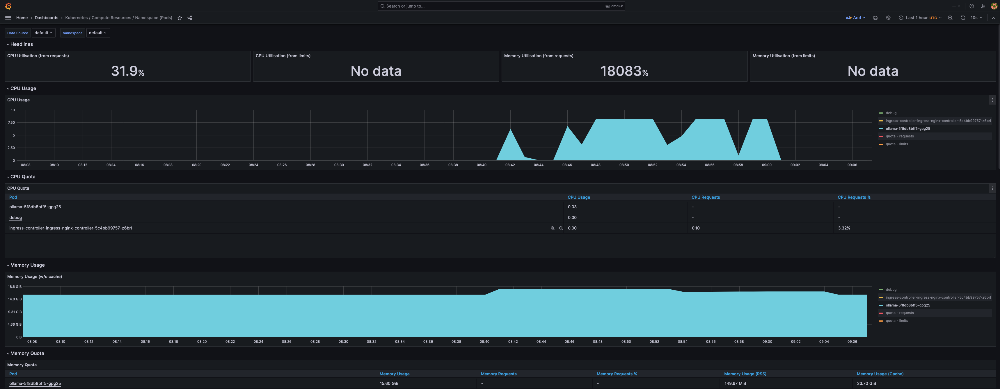

## Overview
* Docker published [GenAI stack](https://www.docker.com/blog/introducing-a-new-genai-stack/) around Oct 2023 which consists of large language models (LLMs) from Ollama, vector and graph databases from Neo4j, and the LangChain framework.
* These utilities can help developers with the resources they need to kick-start creating new applications using generative AI. 
* Ollama can be used to deploy and run LLMs locally. 
* In this exercise we will deploy Ollama to a Kubernetes cluster and prompt it.

## Access to a Kubernetes cluster
* In my case I am using a Tanzu Kubernetes Cluster (TKC) running on vSphere with Tanzu 7u3 platform powered by Dell PowerEdge R640 servers.
* The TKC nodes are using `best-effort-2xlarge` vmclass with 8 CPU and 64Gi Memory.

```
❯ KUBECONFIG=gckubeconfig kubectl get node
NAME                                             STATUS   ROLES                  AGE   VERSION
tkc01-control-plane-cnrm5                        Ready    control-plane,master   36m   v1.23.8+vmware.3
tkc01-control-plane-m8wmt                        Ready    control-plane,master   42m   v1.23.8+vmware.3
tkc01-control-plane-z6b5g                        Ready    control-plane,master   39m   v1.23.8+vmware.3
tkc01-worker-nodepool-a1-pqq7j-fd5784bcc-5m5v8   Ready    <none>                 37m   v1.23.8+vmware.3
tkc01-worker-nodepool-a1-pqq7j-fd5784bcc-9r6t5   Ready    <none>                 32m   v1.23.8+vmware.3
tkc01-worker-nodepool-a1-pqq7j-fd5784bcc-mszdm   Ready    <none>                 42m   v1.23.8+vmware.3
❯
❯
❯ KUBECONFIG=gckubeconfig kubectl cluster-info
Kubernetes control plane is running at https://10.216.24.142:6443
CoreDNS is running at https://10.216.24.142:6443/api/v1/namespaces/kube-system/services/kube-dns:dns/proxy

To further debug and diagnose cluster problems, use 'kubectl cluster-info dump'.
❯
❯ KUBECONFIG=gckubeconfig kubectl version --short
Client Version: v1.22.1
Server Version: v1.23.8+vmware.3
❯
❯ kg vm -n vineetha-poc -o wide
NAME                                             POWERSTATE   CLASS                 IMAGE                                                    PRIMARY-IP      AGE
tkc01-control-plane-cnrm5                        poweredOn    best-effort-2xlarge   ob-20953521-tkgs-ova-photon-3-v1.23.8---vmware.3-tkg.1   172.29.13.106   42m
tkc01-control-plane-m8wmt                        poweredOn    best-effort-2xlarge   ob-20953521-tkgs-ova-photon-3-v1.23.8---vmware.3-tkg.1   172.29.13.102   48m
tkc01-control-plane-z6b5g                        poweredOn    best-effort-2xlarge   ob-20953521-tkgs-ova-photon-3-v1.23.8---vmware.3-tkg.1   172.29.13.103   44m
tkc01-worker-nodepool-a1-pqq7j-fd5784bcc-5m5v8   poweredOn    best-effort-2xlarge   ob-20953521-tkgs-ova-photon-3-v1.23.8---vmware.3-tkg.1   172.29.13.105   43m
tkc01-worker-nodepool-a1-pqq7j-fd5784bcc-9r6t5   poweredOn    best-effort-2xlarge   ob-20953521-tkgs-ova-photon-3-v1.23.8---vmware.3-tkg.1   172.29.13.107   37m
tkc01-worker-nodepool-a1-pqq7j-fd5784bcc-mszdm   poweredOn    best-effort-2xlarge   ob-20953521-tkgs-ova-photon-3-v1.23.8---vmware.3-tkg.1   172.29.13.98    48m
❯
❯ kg vmclass best-effort-2xlarge
NAME                  CPU   MEMORY   AGE
best-effort-2xlarge   8     64Gi     2y326d
❯
❯ KUBECONFIG=gckubeconfig kubectl top node
NAME                                             CPU(cores)   CPU%   MEMORY(bytes)   MEMORY%
tkc01-control-plane-cnrm5                        219m         2%     2107Mi          3%
tkc01-control-plane-m8wmt                        265m         3%     2406Mi          3%
tkc01-control-plane-z6b5g                        340m         4%     2460Mi          3%
tkc01-worker-nodepool-a1-pqq7j-fd5784bcc-5m5v8   220m         2%     2817Mi          4%
tkc01-worker-nodepool-a1-pqq7j-fd5784bcc-9r6t5   165m         2%     3089Mi          4%
tkc01-worker-nodepool-a1-pqq7j-fd5784bcc-mszdm   177m         2%     6083Mi          9%
❯
```

* Following is my TKC yaml spec:
```
❯ kg tkc -n vineetha-poc
NAME    CONTROL PLANE   WORKER   TKR NAME                   AGE   READY   TKR COMPATIBLE   UPDATES AVAILABLE
tkc01   3               3        v1.23.8---vmware.3-tkg.1   35d   True    True
❯
❯ kg tkc tkc01 -n vineetha-poc -oyaml | k neat
apiVersion: run.tanzu.vmware.com/v1alpha2
kind: TanzuKubernetesCluster
metadata:
  labels:
    run.tanzu.vmware.com/tkr: v1.23.8---vmware.3-tkg.1
  name: tkc01
  namespace: vineetha-poc
spec:
  distribution:
    fullVersion: v1.23.8+vmware.3-tkg.1
    version: ""
  settings:
    network:
      cni:
        name: antrea
      pods:
        cidrBlocks:
        - 192.168.0.0/16
      serviceDomain: cluster.local
      services:
        cidrBlocks:
        - 10.96.0.0/12
  topology:
    controlPlane:
      replicas: 3
      storageClass: wcp-ccs-default
      tkr:
        reference:
          name: v1.23.8---vmware.3-tkg.1
      vmClass: best-effort-2xlarge
    nodePools:
    - name: worker-nodepool-a1
      replicas: 3
      storageClass: wcp-ccs-default
      tkr:
        reference:
          name: v1.23.8---vmware.3-tkg.1
      vmClass: best-effort-2xlarge
      volumes:
      - capacity:
          storage: 128Gi
        mountPath: /var/lib/containerd
```

* Note that I've attached additional storage volume of 128Gi to the worker nodes.

## Deploy Ollama to Kubernetes
* In my case, I am running it on a regular Kubernetes cluster without GPU. 
* If you have GPU, additional configuration steps might be required.

```
❯ KUBECONFIG=gckubeconfig kubectl apply -f ollama-cpu-deploy.yaml
```

* If you take a look at the deployment yaml spec, you can see we are pulling multiple models like mistral, llama2, and neural-chat into the ollama container.

## Verify
```
❯ KUBECONFIG=gckubeconfig kubectl get deploy ollama
NAME     READY   UP-TO-DATE   AVAILABLE   AGE
ollama   1/1     1            1           19h
❯
❯ KUBECONFIG=gckubeconfig kubectl get svc ollama
NAME     TYPE        CLUSTER-IP    EXTERNAL-IP   PORT(S)     AGE
ollama   ClusterIP   10.102.96.6   <none>        11434/TCP   2d13h
❯
```

* You can port-forward the ollama service to access it locally.
```
❯ KUBECONFIG=gckubeconfig kubectl port-forward svc/ollama 11434:11434
Forwarding from 127.0.0.1:11434 -> 11434
Forwarding from [::1]:11434 -> 11434
❯
❯ curl localhost:11434
Ollama is running
❯
❯ curl -X POST http://localhost:11434/api/generate -d '{
  "model": "llama2",
  "prompt":"Whats the capital of Germany?"
 }'
{"model":"llama2","created_at":"2024-01-05T08:41:38.088492203Z","response":"\n","done":false}
{"model":"llama2","created_at":"2024-01-05T08:41:38.42050298Z","response":"The","done":false}
{"model":"llama2","created_at":"2024-01-05T08:41:38.733255421Z","response":" capital","done":false}
{"model":"llama2","created_at":"2024-01-05T08:41:39.043257772Z","response":" of","done":false}
{"model":"llama2","created_at":"2024-01-05T08:41:39.343633734Z","response":" Germany","done":false}
{"model":"llama2","created_at":"2024-01-05T08:41:39.657679611Z","response":" is","done":false}
{"model":"llama2","created_at":"2024-01-05T08:41:39.972450612Z","response":" Berlin","done":false}
{"model":"llama2","created_at":"2024-01-05T08:41:40.301184268Z","response":".","done":false}
{"model":"llama2","created_at":"2024-01-05T08:41:40.608282316Z","response":"","done":true,"context":[518,25580,29962,3532,14816,29903,29958,5299,829,14816,29903,6778,13,13,8809,1446,278,7483,310,9556,29973,518,29914,25580,29962,13,13,1576,7483,310,9556,338,5115,29889],"total_duration":9327188010,"load_duration":1002609,"prompt_eval_count":27,"prompt_eval_duration":7133602000,"eval_count":8,"eval_duration":2187474000}
❯
```

* You can also exec into the ollma pod and prompt it.
```
❯ KUBECONFIG=gckubeconfig kubectl get po --selector app=ollama
NAME                      READY   STATUS    RESTARTS   AGE
ollama-5f8db8bff5-gpg25   1/1     Running   0          19h
❯
❯ KUBECONFIG=gckubeconfig kubectl exec -it ollama-5f8db8bff5-gpg25 -- bash
root@ollama-5f8db8bff5-gpg25:/# ollama run llama2
>>> who are you?

I am LLaMA, an AI assistant developed by Meta AI that can understand and respond to human input in a conversational manner. I am trained on a massive dataset of text from the internet and can generate
human-like responses to a wide range of topics and questions. I can be used to create chatbots, virtual assistants, and other applications that require natural language understanding and generation
capabilities.

>>> whats the difference between AI and Generative AI?

Artificial Intelligence (AI) and Generative AI are both subfields of Machine Learning (ML), but they have distinct differences in their approaches and applications:

1. Definition:
	* Artificial Intelligence (AI): Refers to the broader field of research and development aimed at creating machines that can perform tasks that typically require human intelligence, such as perception,
reasoning, learning, and decision-making. AI encompasses various techniques, including rule-based systems, machine learning, and deep learning.
	* Generative AI (GAI): Focuses specifically on the development of algorithms and models capable of generating new, valid data or content, such as images, videos, music, text, or even entire
conversations. GAI techniques include Generative Adversarial Networks (GANs), Variational Autoencoders (VAEs), and other forms of generative modeling.
2. Approach:
	* AI approaches typically involve training machines to perform specific tasks through supervised or unsupervised learning, using labeled data or self-supervision, respectively. The goal is to make
predictions, classify objects, recognize patterns, or solve problems based on the learned patterns in the training data.
	* GAI, on the other hand, involves generating new content or data through a process of creativity and imagination. Unlike AI, which focuses on recognizing and mimicking existing patterns, GAI algorithms
aim to create novelty, exploring new possibilities and combinations of features or elements.
3. Applications:
	* AI applications can be found in various fields, including natural language processing (NLP), computer vision, robotics, expert systems, and more. Examples include chatbots, virtual assistants, image
recognition systems, self-driving cars, and medical diagnosis tools.
	* GAI applications are primarily focused on generating new content or data, such as:
		+ Image and video synthesis: Creating realistic images or videos of objects, scenes, or people that do not exist in reality.
		+ Music generation: Composing original melodies, harmonies, or rhythms based on various styles, genres, or inputs.
		+ Text generation: Producing coherent and contextually relevant text, such as chatbot responses, articles, or stories, without the need for human intervention.
		+ Voice synthesis: Generating natural-sounding voices for various applications, like audiobooks, voice assistants, or character voices in video games.
4. Challenges and limitations:
	* Both AI and GAI face challenges related to the quality of the generated content, as well as the need for large amounts of training data.
	* AI models can struggle with domain adaptation, where they are applied to new environments or tasks without proper fine-tuning, leading to reduced performance.
	* GAI models require careful design and curation of training datasets to avoid biases in the generated content, as well as the need for continuous improvement to maintain high-quality output.
5. Future prospects:
	* As AI and GAI continue to advance, we can expect more sophisticated applications across various industries, including entertainment, advertising, healthcare, and education.
	* The integration of AI and GAI may lead to the development of new hybrid models that combine the strengths of both approaches, creating even more powerful tools for problem-solving and creativity.

In summary, while AI focuses on performing tasks and recognizing patterns in existing data, Generative AI aims to create novel content or data through creativity and imagination. Both fields have their
unique applications, challenges, and future prospects, and their collaboration may lead to even more innovative solutions in the years to come.

>>> Send a message (/? for help)
>>> /bye
root@ollama-5f8db8bff5-gpg25:/# ollama run neural-chat
>>>
>>> who are you?
 I am an AI-powered language model trained to help and assist people by providing useful information. My goal is to support and enhance your experience by being a helpful guide and friend. However, my
capabilities are limited to the knowledge base I have been trained with, so I might not always know everything or be able to share personal experiences like humans can.

>>> whats your accuracy level?
 My accuracy level depends on various factors, such as the context and complexity of the task or query. However, as an AI language model trained with vast amounts of data and knowledge, I am capable of
providing relatively accurate responses most of the time. My accuracy may vary depending on the specific topic being discussed, but generally speaking, I try my best to deliver precise and relevant
information.

>>> Send a message (/? for help)
```

## Resource usage and monitoring
* Following is the resource usage overview while we prompt the LLM.
```
❯ KUBECONFIG=gckubeconfig kubectl top no
NAME                                             CPU(cores)   CPU%   MEMORY(bytes)   MEMORY%
tkc01-control-plane-cnrm5                        287m         3%     3287Mi          5%
tkc01-control-plane-m8wmt                        258m         3%     3336Mi          5%
tkc01-control-plane-z6b5g                        338m         4%     3508Mi          5%
tkc01-worker-nodepool-a1-pqq7j-fd5784bcc-5m5v8   178m         2%     2998Mi          4%
tkc01-worker-nodepool-a1-pqq7j-fd5784bcc-9r6t5   189m         2%     3768Mi          5%
tkc01-worker-nodepool-a1-pqq7j-fd5784bcc-mszdm   4255m        53%    12860Mi         19%
❯
❯ KUBECONFIG=gckubeconfig kubectl top po -o wide
Error: unknown shorthand flag: 'o' in -o
See 'kubectl top pod --help' for usage.
❯ KUBECONFIG=gckubeconfig kubectl top po
NAME                                                           CPU(cores)   MEMORY(bytes)
debug                                                          0m           143Mi
ingress-controller-ingress-nginx-controller-5c4bb99757-z6brl   1m           148Mi
ollama-5f8db8bff5-gpg25                                        4083m        9072Mi
❯
❯ KUBECONFIG=gckubeconfig kubectl get po ollama-5f8db8bff5-gpg25 -o wide
NAME                      READY   STATUS    RESTARTS   AGE   IP             NODE                                             NOMINATED NODE   READINESS GATES
ollama-5f8db8bff5-gpg25   1/1     Running   0          19h   192.168.1.21   tkc01-worker-nodepool-a1-pqq7j-fd5784bcc-mszdm   <none>           <none>
❯
```

* I have Prometheus stack installed on this Kubernetes cluster. From the following Grafana screenshot you can see the CPU spikes while we prompt the model.



## References
* https://ollama.ai/
* https://github.com/jmorganca/ollama
* https://github.com/cncf/llm-starter-pack/tree/main
* https://github.com/docker/genai-stack
* https://github.com/PromptEngineer48
* https://github.com/williamcaban/ollama-ubi