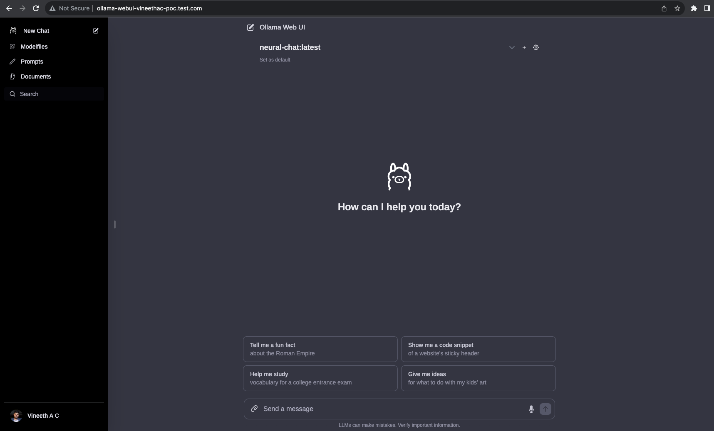
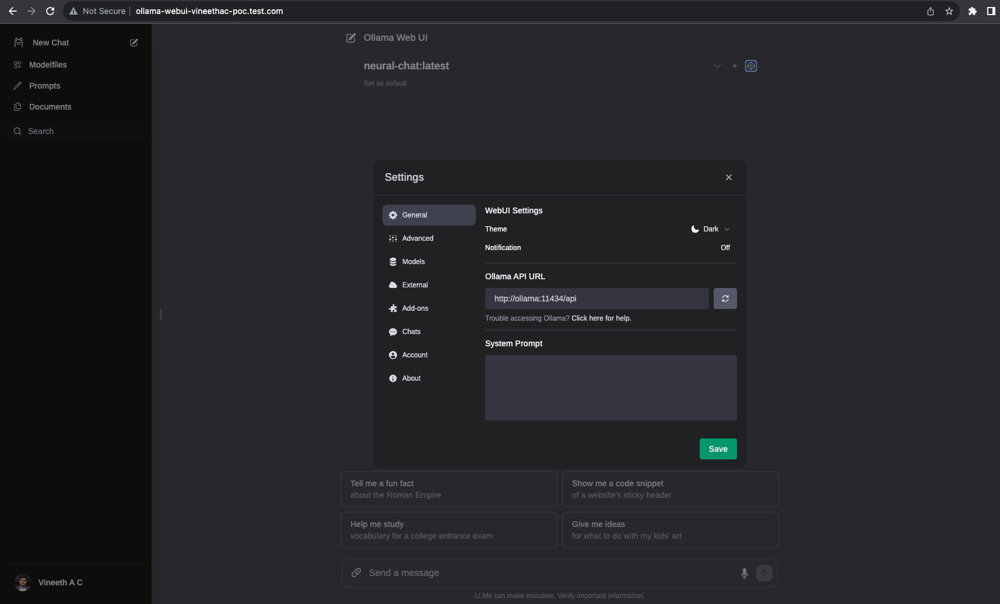
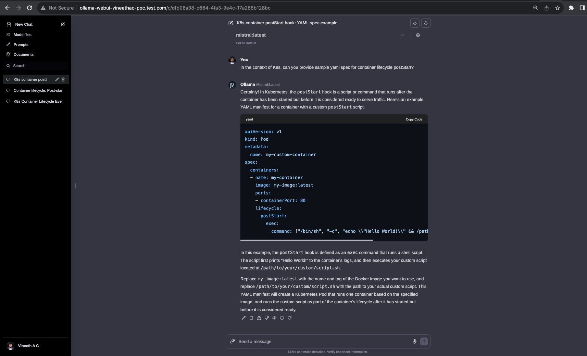

## Overview
* In this exercise we will take a look at deploying a Web UI on Kubernetes that can interact with Ollama and prompt the available LLMs.
* This will give you a ChatGPT like experience while interacting with different language models.

## Prerequisites
* Access to a Kubernetes cluster.
* [Deploy Ollama on the Kubernetes cluster](https://github.com/vineethac/Ollama/tree/main/ollama_on_kubernetes)

## Deploy Ollama Web UI on Kubernetes
* Ollama is already deployed on the cluster.

```
❯ KUBECONFIG=gckubeconfig kg deploy ollama
NAME     READY   UP-TO-DATE   AVAILABLE   AGE
ollama   3/3     3            3           10d
❯
❯ KUBECONFIG=gckubeconfig kg svc,ep ollama
NAME             TYPE        CLUSTER-IP    EXTERNAL-IP   PORT(S)     AGE
service/ollama   ClusterIP   10.102.96.6   <none>        11434/TCP   11d

NAME               ENDPOINTS                                                 AGE
endpoints/ollama   192.168.1.26:11434,192.168.5.13:11434,192.168.8.7:11434   11d
❯
```

* Deploy the Web UI. Note that you may need to check/ modify `OLLAMA_API_BASE_URL` in the deployment yaml spec depending where your Ollama is running/ exposed. 

```
❯ KUBECONFIG=gckubeconfig k apply -f ollama-webui.yaml
```

* This will create a PVC, deployment resource, service that exposes this web application internally within the Kubernetes cluster, and an ingress resource that provides external access to the Ollama Web UI.

```
❯ KUBECONFIG=gckubeconfig kg pvc ollama-webui-data-pvc
NAME                    STATUS   VOLUME                                     CAPACITY   ACCESS MODES   STORAGECLASS      AGE
ollama-webui-data-pvc   Bound    pvc-12ba2d46-4b2a-4c42-9ab3-20ad2c556b85   50Gi       RWO            wcp-ccs-default   32h
❯
❯ KUBECONFIG=gckubeconfig kg deploy ollama-webui
NAME           READY   UP-TO-DATE   AVAILABLE   AGE
ollama-webui   1/1     1            1           32h
❯
❯ KUBECONFIG=gckubeconfig kg svc,ep ollama-webui
NAME                   TYPE        CLUSTER-IP      EXTERNAL-IP   PORT(S)    AGE
service/ollama-webui   ClusterIP   10.111.183.17   <none>        8080/TCP   30h

NAME                     ENDPOINTS          AGE
endpoints/ollama-webui   192.168.8.5:8080   30h
❯
❯ KUBECONFIG=gckubeconfig kg po -o wide -l app=ollama-webui
NAME                            READY   STATUS    RESTARTS   AGE   IP            NODE                                             NOMINATED NODE   READINESS GATES
ollama-webui-7d5b74cc5b-x757s   1/1     Running   0          31h   192.168.8.5   tkc01-worker-nodepool-a1-pqq7j-fd5784bcc-cxmwm   <none>           <none>
❯
❯ KUBECONFIG=gckubeconfig kg ing
NAME               CLASS   HOSTS                                 ADDRESS        PORTS   AGE
ollama-webui-ing   nginx   ollama-webui-vineethac-poc.test.com   10.216.24.45   80      30h
❯
```

## Access Ollama Web UI
* For the purpose of testing, I've added the ingress IP and hostname to my local /etc/hosts file in my Mac, so that name resolution works!

```
❯ cat /etc/hosts | grep 10.216.24.45
10.216.24.45 fastapi-vineethac-poc.test.com
10.216.24.45 grafana-vineethac-poc.test.com
10.216.24.45 prometheus-vineethac-poc.test.com
10.216.24.45 grafana-loki-vineethac-poc.test.com
10.216.24.45 ollama-webui-vineethac-poc.test.com
❯
```

* Now the Ollama Web UI should be accessible through your browser at: `ollama-webui-vineethac-poc.test.com`
* The very first time you access the Web UI, it will ask you to signup with a username and password.

## Prompt/ chat with the models
* You can click on `New Chat`, select the available model and then start interacting with it.



* Following is the settings page where you can see the Ollama API URL:



* Sample interaction with `mistral` model is given below.



## References
* https://github.com/ollama-webui/ollama-webui
* https://github.com/ollama-webui/ollama-webui/tree/main/kubernetes

